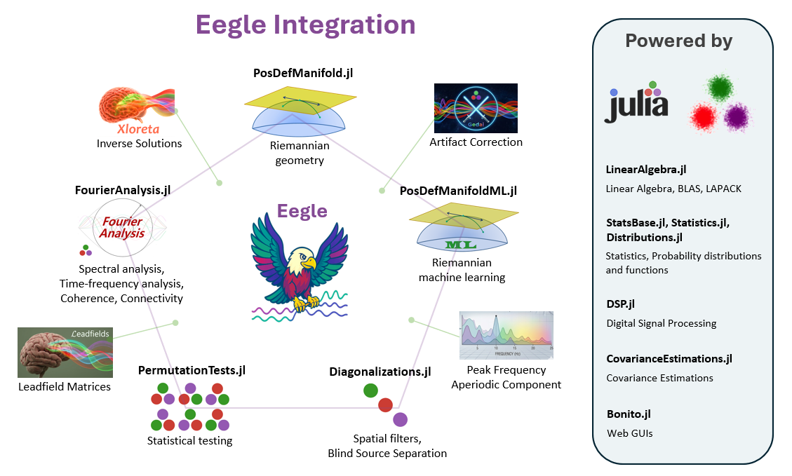

---

| Documentation & Tutorials | EEG BCI Data | Package's Clones | Unicode Symbol | Official Logo |  
|:-----:|:-----:|:-----:|:-----:|:-----:|
| [](https://Marco-Congedo.github.io/Eegle.jl) [](https://marco-congedo.github.io/Eegle.jl/dev/) [](https://marco-congedo.github.io/Eegle.jl/stable/Tutorials/) | [](https://zenodo.org/records/17801878) [](https://zenodo.org/records/18379398) | [](https://github.com/FhmDmi/pyLittleEegle) | 🦅 `\:eagle:`|  |  

# Eegle (EEG general library) 

This is a pure-[**julia**](https://julialang.org/) 95%-human package for human EEG (Electroencephalography) data analysis and classification.

It is the fundamental brick allowing the integration of several packages dedicated to human EEG.



---

## 🧩 Requirements

**Julia**: version ≥ 1.10

---
## 📦 Installation

Execute the following command in julia's REPL:

```julia
    ]add Eegle
```
The package is self-contained, as it re-exports several packages and all its submodules. 

---

## —͟͟͞͞★ Quick Start

A large collection of [tutorials](https://marco-congedo.github.io/Eegle.jl/stable/Tutorials/) (mostly to come) will get you on track.

---
## 🤔 Disclaimer

**Eegle** is currently under development and the full testing process has not been completed. 

---
## ✍️ About the authors

[Marco Congedo](https://sites.google.com/site/marcocongedo), corresponding author, is a Research Director of [CNRS](http://www.cnrs.fr/en) (Centre National de la Recherche Scientifique), working at [UGA](https://www.univ-grenoble-alpes.fr/english/) (University of Grenoble Alpes). **Contact**: first name dot last name at gmail dot com.

[Fahim Doumi](https://www.linkedin.com/in/fahim-doumi-4888a9251/?locale=fr_FR) at the time of writing was a research ingeneer at the Department of Enginnering of the [University Federico II of Naples](https://www.unina.it/en_GB/home).

---
## 🌱 Contribute

Please read the [guidelines](https://marco-congedo.github.io/Eegle.jl/stable/Eegle/#How-to-Contribute) and contact the authors if you are interested in contributing.

---
| 📖 **Documentation**  | 
|:-------------------------------------:|
| [](https://Marco-Congedo.github.io/Eegle.jl/stable) | 
| [](https://Marco-Congedo.github.io/Eegle.jl) | 
| [](https://marco-congedo.github.io/Eegle.jl/stable/Tutorials/) |
