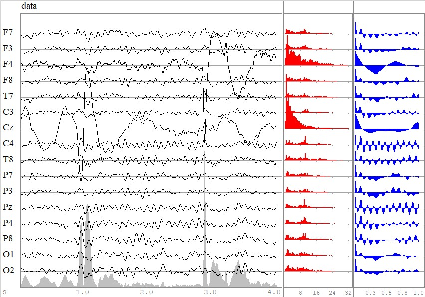
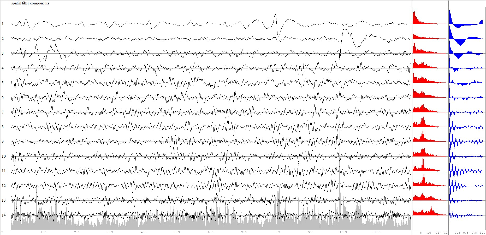
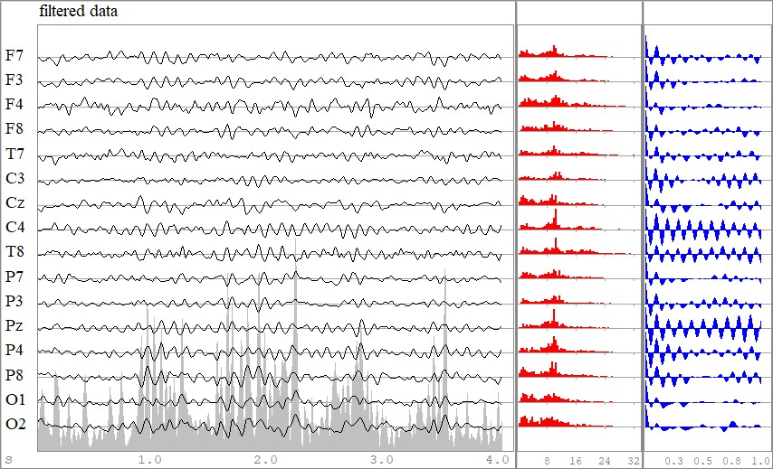
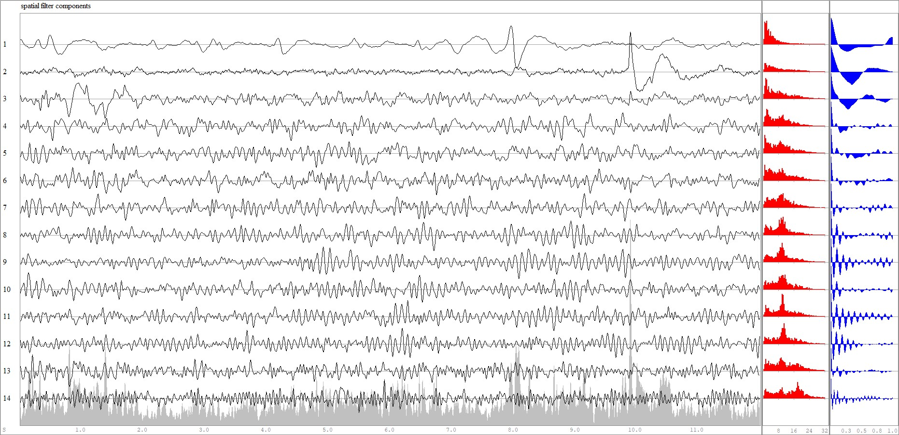
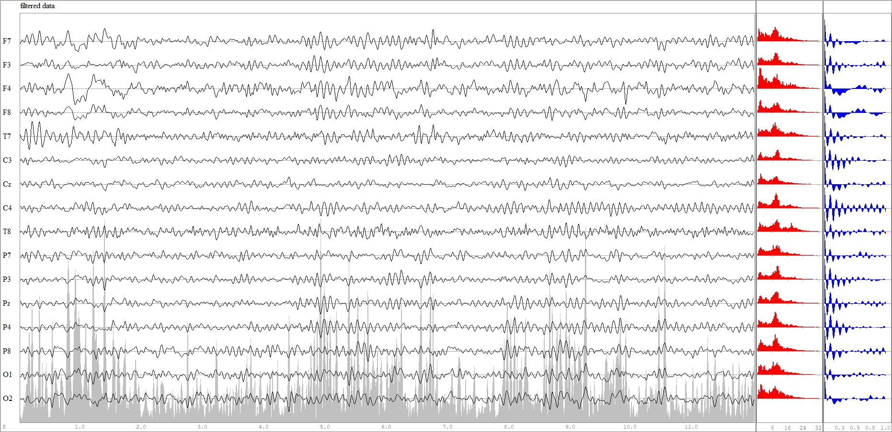

# Tutorial SF 1

Gievn an EEG data matrix ``X`` of dimension ``t⋅n``, a **spatial filter** ``Bₛ`` is a matrix of dimension ``n⋅p``, with ``p<n``.

The spatial filter has a left-inverse ``Aₛ`` of dimension ``p⋅n`` verifying ``AₛBₛ=I``, where ``I`` is the identity matrix.

The goal of spatial filters is to filter out ``n-p`` undesired components, thus they are very useful
for removing noise, or, more in general, unwanted components from the data. 
They work by sorting the components according to a measurable criterion. Then, the components within a suitable range of the criterion are eliminated.

In fact, ``Bₛ`` is formed by a subset of ``p`` columns  of ``B`` and ``Aₛ`` is formed by the same subset of ``p`` rows of ``A``. 

All **filtered components** are given by 

``Y=XB`` ``\hspace{1cm}`` [Eq.1].

``Y`` has the same dimension as ``X``. Each component (column) of ``Y`` is obtained as a linear combination of the sensors, that is, a *spatial combination*. The subset of interest is given by ``Yₛ=XBₛ``.

The **filtered data** in the sensor space retaining only the components of interest is given by 

``Z=YₛAₛ=XBₛAₛ`` ``\hspace{1cm}`` [Eq.2].

## Constructing Spatial Filters

The package [Diagonalizations.jl](https://github.com/Marco-Congedo/Diagonalizations.jl), which is re-exported by **Eegle**,
features several useful spatial filters for EEG, such as:

- [PCA](https://marco-congedo.github.io/Diagonalizations.jl/stable/pca/): sort components by variance
- [Whitening](https://marco-congedo.github.io/Diagonalizations.jl/stable/whitening/): as PCA, but also standardize the variance
- [CSP](https://marco-congedo.github.io/Diagonalizations.jl/stable/csp/): sort components 
    - by variance ratio between one class with respect to another
    - by signal-to-noise ratio of ERPs (X-DAWN)
- [MCA](https://marco-congedo.github.io/Diagonalizations.jl/stable/mca/): sort components by cross-covariance between two EEG epochs
- [CCA](https://marco-congedo.github.io/Diagonalizations.jl/stable/cca/): sort components by cross-correlation between two EEG epochs.

In this tutorial, we will see how to construct spatial filters based on the *generalized eigenvalue-eigenvector decomposition* (*GEVD*), which is one of the most useful and powerful technique in signal processing.

In linear algebra, GEVD is synonymous of *joint diagonalization*, in that such spatial filters verify

``\left \{ \begin{array}{rl}B^TCB=I\\B^TSB=Λ \end{array} \right.``, ``\hspace{1cm}`` [Eq.3]

where 
- ``Λ`` is a diagonal matrix holding the generalized eigenvalues, which are sorted according to the specified criterion, 
- ``B`` is the matrix holding in the columns the corresponding generalized eigenvectors providing the filters.

For most spatial filters 
- ``C`` is the covariance matrix of ``X``, 
- ``S`` is a covariance matrix which definition yields the specificity of each spatial filter.

**Let us see now how to construct two new spatial filters:**
- **SFA**, which stands for Slow Feature Analysis [Wiskott2002SFA](@cite): sort components data by *slowness*,
- **MoSc** [Molgedey1994TDSEP](@cite): sort components by *autocorrelation*.

As we will show, these two filters tends in general to give similar results, since slowness and autocorrelation at early lags are closely related characteristics of time-series.

Note that, in practice we do not compute the filters by GEVD, but by a two-step procedures, which is numerically more stable:

**Step 1:** Let ``\hspace{0.1cm}C=V^TDV`` be the eigenvalue-eigenvector decomposition (EVD) of ``C`` and define 

``W=VD^{-1/2}`` and ``W^{+}=D^{1/2}V^T``

``W`` is a whitening matrix, that is, it verifies ``W^TCW=I``.

**Step 2:** do ``\hspace{0.1cm}\textrm{EVD}(W^TSW)=UΛU^{T}``

Finally, we obtain ``B=WU`` and ``A=U^TW^+``.

As a data example we use the [`EXAMPLE_P300_1`](@ref) example P300 BCI example file provided with **Eegle**, selecting 4s from second 77 to second 81. Figure 1 shows the time series of the epoch submitted to spatial filtering (the data ``X``).


**Figure 1** *The EEG epoch used as example, along with the global field power (grey shaded area), amplitude spectra in the range 1Hz-32Hz (red) and autocorrelation function for lags up to 1s (blue)*

As it can be seen, there are artifacts due to F4 and Cz electrodes contact loss. 

## SFA

It is defined by [Eq.3] setting 
- ``C`` as the sample covariance matrix of ``X``
- ``S`` as the sample covariance matrix of the first-differences of ``X``.

First, let us write a function to compute ``B`` and ``A`` with the two-step procedures here above is

```julia
function sfa(X::AbstractMatrix{T};
            eVar::Union{Float64, Int64, Nothing} = nothing) where T<: Real
    C = covmat(X; covtype = SCM)
    S = covmat(diff(X, dims=1); covtype = SCM)
    white = whitening(C; eVar)
    U = eigvecs(white.F'*S*white.F)
    return white.F*U, U'*white.iF
end
```

The `eVar` argument allows to determine dimensionality reduction during the first step (whitening) in the two-step procedure above. For details on how to use it, see [here](https://marco-congedo.github.io/Diagonalizations.jl/stable/Diagonalizations/#subspace-dimension).

The SFA is obtained as

```julia
B, A = sfa(X)
```

All filter components [Eq.1] are given as

```julia
Y = X*B # all filter components
```

The plot of ``Y`` is shown in figure 2. 


**Figure 2** *All filter componenets obtained by SFA. They are sorted by slowness*. 

We ought to remove the first two components
and compute the filtered data in the sensor space retaining only the remaining components [Eq.2]:

```julia
p = n-2
D = Diagonal([zeros(n-p); ones(p)])
Z=Y*D*G
```

The plot of the filtered data is in Fig. 3. This is to be compared with Fig. 1.

**Figure 3** *Data filtered by SFA removing the first two components*. 

As one can see the artifacts have been removed.

**NB:** No spatial filter is perfect. Along with undesired components, some cerebral activity will be filtered out as well.
While this is not an obstacle in some applications, for example, classification of data, it may be so in others,
for example, when we wish to interpret the result neurophysiologically in a clinical study.

## MoSc

It is again defined by [Eq.3] setting 
- ``C`` as the sample covariance matrix of ``X``
- ``S`` as the autocovariance matrix with a lag, here taken as 1.

First, let us write a function to compute ``B`` and ``A`` with the two-step procedures here above. With the exception of one line, it is identical to the function for the SFA:

```julia
function mosc(X::AbstractMatrix{T};
            eVar::Union{Float64, Int64, Nothing} = nothing) where T<: Real

    C = covmat(X; covtype = SCM)
    S = hermitianpart(covmat(X, 1; covtype = SCM))  
    white = whitening(C; eVar)
    U = reverse(eigvecs(white.F'*S*white.F), dims=2)
    return white.F*U, U'*white.iF
end
```
All in all as for SFA, the MoSc is obtained as

```julia
B, A = mosc(X)
```

All filter components [Eq.1] are given as

```julia
Y = X*B # all filter components
```

The plot of ``Y`` is in Fig. 4


**Figure 4** *All filter componenets obtained by MoSC. They are sorted by autocovariance at lag 1*. 

Again, we ought to remove the first two components and compute the filtered data in the sensor space retaining only the remaining components [Eq.2]:

```julia
p = n-2
D = Diagonal([zeros(n-p); ones(p)])
Z=Y*D*G
```

The plot of the filtered data is in Fig. 5. This is to be compared with Fig. 1.

**Figure 5** *Data filtered by MoSc removing the first two components*. 

As one can see the artifacts have been, once gain, removed. The result is very close to the one obtained by SFA.

## Conclusion

Using joint diagonalization a very large number of filters can be obtained.

**NB:** In general, better results are obtained extending procedures based on the *joint diagonalization* of two matrices to
the *approximate joint diagonalization* of several matrices ([congedo2008bss](@cite), [Congedo2013HDR](@cite), [GouyPailler2010](@cite)). 

