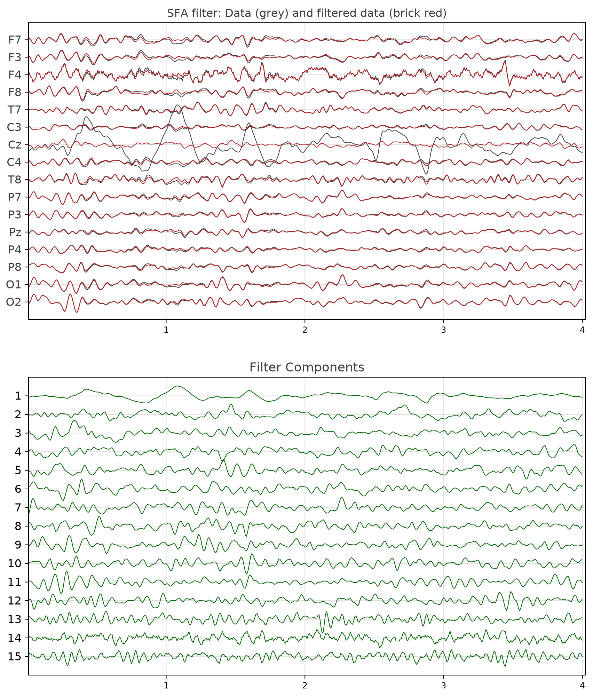
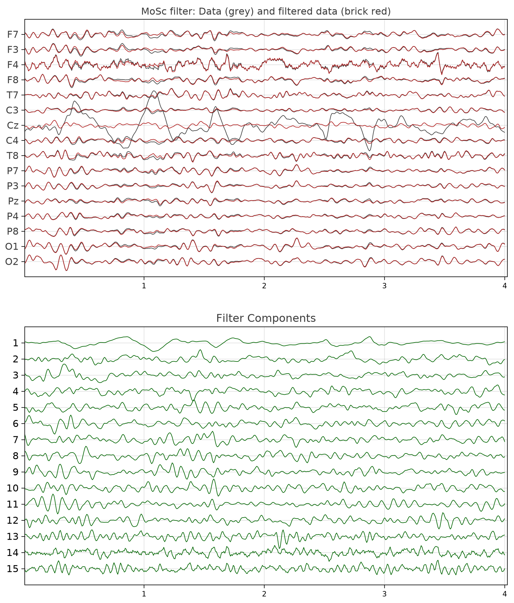

# Tutorial SF 1

[💻 Full Code](@ref "Code for Tutorial SF 1")

This tutorial demonstrates how to construct spatial filters based on the *generalized eigenvalue-eigenvector decomposition*.

!!! info
    Knowledge of basic linear algebra is assumed. Go through this tutorial only if you are interested in building your own spatial filters.

Given an EEG data matrix ``X`` of dimension ``T⋅N``, where ``T`` is the number of samples and ``N`` the number of sensors, a **spatial filter** ``Bₛ`` is a matrix of dimension ``N⋅P``, with ``P<N``.

The spatial filter has a left-inverse ``Aₛ`` of dimension ``P⋅N`` verifying ``AₛBₛ=I``, where ``I`` is the identity matrix.

The goal of spatial filters is to filter out ``Q=N-P`` undesired components, thus they are very useful
for removing noise, or, more in general, unwanted components from the data. 
They work by sorting the components according to a measurable criterion. Then, the components within a suitable range of the criterion are eliminated.

In fact, ``Bₛ`` is formed by a subset of ``P`` columns  of ``B`` and ``Aₛ`` is formed by the same subset of ``P`` rows of ``A``. 

All **filtered components** are given by 

``Y=XB`` ``\hspace{1cm}`` [Eq.1].

``Y`` has the same dimension as ``X``. Each component (column) of ``Y`` is obtained as a linear combination of the sensors, that is, a *spatial combination*. The subset of interest is given by ``Yₛ=XBₛ``.

The **filtered data** in the sensor space retaining only the components of interest is given by 

``Z=YₛAₛ=XBₛAₛ`` ``\hspace{1cm}`` [Eq.2].

## Constructing Spatial Filters

> 📦 
> The package [Diagonalizations.jl](https://github.com/Marco-Congedo/Diagonalizations.jl), which is re-exported by **Eegle**,
> features several useful spatial filters for EEG, such as:
>
> - [PCA](https://marco-congedo.github.io/Diagonalizations.jl/stable/pca/): sort components by variance
> - [Whitening](https://marco-congedo.github.io/Diagonalizations.jl/stable/whitening/): as PCA, but also standardize the variance of all components
> - [CSP](https://marco-congedo.github.io/Diagonalizations.jl/stable/csp/): sort components 
>    - by variance ratio between one class with respect to another
>    - by signal-to-noise ratio of ERPs (X-DAWN)
> - [MCA](https://marco-congedo.github.io/Diagonalizations.jl/stable/mca/): sort components by cross-covariance between two EEG epochs
> - [CCA](https://marco-congedo.github.io/Diagonalizations.jl/stable/cca/): sort components by cross-correlation between two EEG epochs.

In this tutorial, we will see how to construct custom spatial filters based on the *generalized eigenvalue-eigenvector decomposition* (*GEVD*), which is one of the most useful and powerful technique in signal processing.

In linear algebra, GEVD is synonymous of *joint diagonalization*, in that such spatial filters verify

``\left \{ \begin{array}{rl}B^TCB=I\\B^TSB=Λ \end{array} \right.``, ``\hspace{1cm}`` [Eq.3]

where 
- ``Λ`` is a diagonal matrix holding the generalized eigenvalues, which are sorted according to the specified criterion, 
- ``B`` is the matrix holding in the columns the corresponding generalized eigenvectors providing the filters.

For most spatial filters 
- ``C`` is the covariance matrix of ``X``, 
- ``S`` is a covariance matrix which definition yields the specificity of each spatial filter.

**Let us see now how to construct new spatial filters.** For instance, we will consider:
- **SFA**, which stands for Slow Feature Analysis [Wiskott2002SFA](@cite): sort components data by *slowness*,
- **MoSc** [Molgedey1994TDSEP](@cite): sort components by *autocorrelation*.

As we will show, these two filters tends in general to give similar results, since slowness and autocorrelation at early lags are closely related characteristics of time-series.

> 🔍 Note that, in practice we do not compute the filters by GEVD, but by a two-step procedures, which is numerically more stable:
> 
> **Step 1:** Let ``\hspace{0.1cm}C=V^TDV`` be the eigenvalue-eigenvector decomposition (EVD) of ``C`` and define 
> 
> ``W=VD^{-1/2}`` and ``W^{+}=D^{1/2}V^T``
> 
> ``W`` is a whitening matrix, that is, it verifies ``W^TCW=I``.
> 
> **Step 2:** do ``\hspace{0.1cm}\textrm{EVD}(W^TSW)=UΛU^{T}``
> 
> Finally, we obtain ``B=WU`` and ``A=U^TW^+``.

As a data example we use the [`EXAMPLE_P300_1`](@ref) example P300 BCI example file provided with **Eegle**, selecting 4s from second 55 to second 59. 

Let as tell Julia the package we will need and load the data

```julia
using Eegle, EEGPlot, CairoMakie
o = readNY(EXAMPLE_P300_1) # from Eegle.InOut.jl
X = o.X[55*o.sr:59*o.sr, :]
```

For plotting the data we will use the [EEEPlot](https://github.com/Marco-Congedo/EEGPlot.jl) package,
which allows to plot several time series at the same time.

!!! details "show the plotting function wi will be using"
    ```julia
    plot_data(title) =
        eegplot(X, o.sr, o.sensors;
            fig_size = (920, 1100),
            X_title =title * ": Data (grey) and filtered data (brick red)",
            X_labels_font_size = 16,
            X_title_font_size = 16,
            Y,
            Y_title ="Filter Components",
            Y_labels_font_size = 16,
            Y_title_font_size = 18,
            overlay = Z)
    ```

## SFA

It is defined by [Eq.3] setting 
- ``C`` as the sample covariance matrix of ``X``
- ``S`` as the sample covariance matrix of the first-differences of ``X``.

So, here is a function to compute ``B`` and ``A`` with the two-step procedures here above:

```julia
function sfa(X::AbstractMatrix{T};
            eVar::Union{Float64, Int64, Nothing} = nothing) where T<: Real
    C = covmat(X; covtype = SCM) # from Eegle.BCI.jl
    S = covmat(diff(X, dims=1); covtype = SCM)
    white = whitening(C; eVar) # from Diagonalizations.jl
    U = eigvecs(white.F'*S*white.F) # from LinearAlgebra.jl
    return white.F*U, U'*white.iF
end
```

!!! tip 
    The `eVar` argument allows to determine dimensionality reduction during the first step (whitening) in the two-step procedure above. For details on 
    how to use it, see [here](https://marco-congedo.github.io/Diagonalizations.jl/stable/Diagonalizations/#subspace-dimension).

The SFA is obtained as

```julia
B, A = sfa(X)
```

All filter components [Eq.1] are given as

```julia
Y = X*B # all filter components
```

Figure 1 shows the time series of the epoch ``X`` submitted to spatial filtering in grey and
the filter components ``Y`` in green. As it can be seen, in the data ``X`` there are artifacts due to Cz electrodes contact loss
and they are captured by the first component in ``Y`` (the amplitude and sign of the components is arbitrary).


**Figure 1** *The EEG epoch used as example, along with the SFA filter components and the filtered data obtained removing the first component*

We sought to remove the first component (``Q=N-P=1``)
and compute the filtered data in the sensor space retaining only the remaining ``P`` components [Eq.2].

For doing so, we create a diagonal matrix holding ``Q`` zeros and as many ones as necessary to reach the 
subspace dimension in which ``Y`` has been projected by whitening:

```julia
q = 1
D = Diagonal([zeros(q); ones(size(Y, 2)-q)])
Z = Y*D*A
```

The plot of the filtered data is shown in Fig. 1 in brick red. As one can see, the artifacts have been removed.

Figure 1 is obtained by:

```julia
plot_data("SFA filter")
```

!!! warning 
    No spatial filter is perfect. Along with undesired components, some cerebral activity will be filtered out as well.
    While this is not an obstacle in some applications, for example, classification of data, it may be so in others,
    for example, when we wish to interpret the result neurophysiologically in a clinical study.

## MoSc

It is again defined by [Eq.3] setting 
- ``C`` as the sample covariance matrix of ``X``
- ``S`` as the autocovariance matrix with a lag, here taken as 1.

First, let us write a function to compute ``B`` and ``A`` with the two-step procedures here above. With the exception of one line, it is identical to the function for the SFA:

```julia
function mosc(X::AbstractMatrix{T};
            eVar::Union{Float64, Int64, Nothing} = nothing) where T<: Real

    C = covmat(X; covtype = SCM)
    # since the autocovariance matrix is not symmetrical,
    # we take its symmetric part
    S = hermitianpart(covmat(X, 1; covtype = SCM))  
    white = whitening(C; eVar)
    # we use `reverse` to sort components by decreasing
    # order of autocorrelation
    U = reverse(eigvecs(white.F'*S*white.F), dims=2)
    return white.F*U, U'*white.iF
end
```
All in all as for SFA, the MoSc is obtained as

```julia
B, A = mosc(X)
```

All filter components [Eq.1] are given as

```julia
Y = X*B # all filter components
```

Figure 2 shows the time series of the epoch ``X`` submitted to spatial filtering in grey and
the filter components ``Y`` in green. Note that the sign of the first component , which is, again, the one capturing the artifacts,
this time is flipped. This is is normal, as the sign of the components is arbitrary.


**Figure 2** *The EEG epoch used as example, along with the MoSc filter components and the filtered data obtained removing the first component*

Again, we sought to remove the first component and compute the filtered data in the sensor space retaining only the remaining components [Eq.2]:

```julia
q = 1
D = Diagonal([zeros(q); ones(size(Y, 2)-q)])
Z = Y*D*A
```

The plot of the filtered data is shown in Fig. 2 in brick red. As one can see, the artifacts have been, once again, removed.
The result is very close to the one obtained by SFA.

Figure 2 is obtained by:

```julia
plot_data("MOSC filter")
```

## Conclusion

Using joint diagonalization a very large number of filters can be obtained, besides those
already provided by [Diagonalizations.jl](https://github.com/Marco-Congedo/Diagonalizations.jl).

> 📌
> **NB** In general, better results are obtained extending procedures based on the *joint diagonalization* of two matrices to
> the *approximate joint diagonalization* of several matrices [congedo2008bss](@cite), [Congedo2013HDR](@cite), [GouyPailler2010](@cite). 
> Those can be obtained with the help of *Diagonalizations.jl* as well.

***
#### Code for Tutorial SF 1

```@example
using Eegle # hide
parseTutorial("Tutorial Spatial Filters 1") # hide
```

[⬆️ Go to Top](@ref "Tutorial SF 1")

