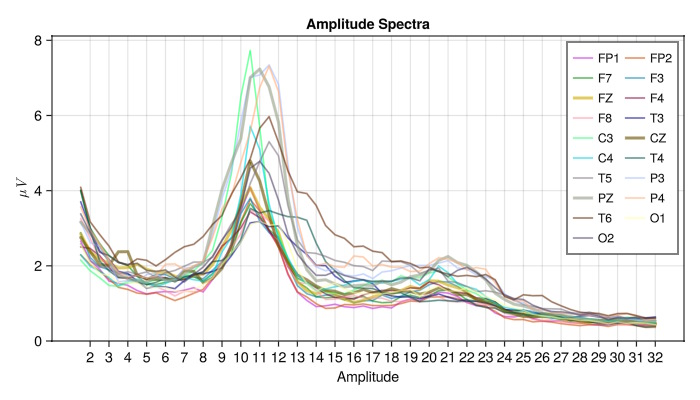
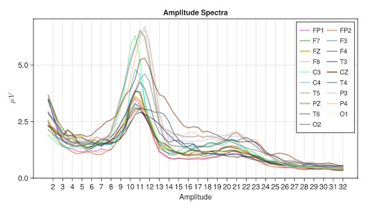

# Tutorial SA 1

A stannard task in the analysis of continuous EEG recording is to compute the average power spectrum.

This tutorial uses the example normative EEG file provided with **Eegle** and shows how to

1. Read the example file (in ASCII text format) and associated file of sensor labels
2. Compute the spectra with the [Welch method](https://en.wikipedia.org/wiki/Welch%27s_method)
3. Plot the spectra

!!! info
    As an example of possible options for computing spectra, it is shown how to use the [Hann](https://en.wikipedia.org/wiki/Hann_function) tapering window and the [Slepian](https://en.wikipedia.org/wiki/Slepian_function) multi-tapering windows. For other options see the 
    [spectra](https://marco-congedo.github.io/FourierAnalysis.jl/dev/spectra/#FourierAnalysis.spectra) function. 

---

Tell julia the package to be used

```julia
using Eegle, FourierAnalysis, GLMakie, Colors
```

Load the example normative file (eyes-closed) and the associated sensor labels file.

This is a 80s recording on a 20yo woman. The sampling rate and number of electrodes are 128 and 19, respectively. Data have been previously high-passed at 1.5 Hz. The following functions are in module **Eegle** module [InOut.jl](@ref).

```julia
X = readASCII(EXAMPLE_Normative_1)

sensors = readSensors(EXAMPLE_Normative_1_sensors)
```

Compute amplitude spectra (square root of the power spectra) using the Welch method (50% overlapping sliding window),
with 0.5 Hz frequency resolution (`fr`), applying the Hann tapering windows.

```julia
sr, fr, ne = 128, 2, length(sensors)

S = spectra(X, sr, sr*fr; 
            tapering = FourierAnalysis.hann,
            func = √) # any function can be used here
```

Select the spectra from 1.5 (`minf`) to 32 Hz (`maxf`). The function `f2b` tells us what bin in the spectra corresponds to `minf` and `maxf`.
The data is retrieved as the .y field of [Spectra](https://marco-congedo.github.io/FourierAnalysis.jl/dev/spectra/#Spectra) object `S`.

```julia
minf, maxf = 1.5, 32
minb = f2b(minf, sr, sr*fr)
maxb = f2b(maxf, sr, sr*fr)
S_ = S.y[minb:maxb, :]
```

Plot the spectra using GLMakie.jl. The figure will open in a new window. It is resizable and can be inspected, by zooming and panning (right mouse click). Use CTRL+click to reset the plot. Click on a legend element to identify the spectra

```julia
begin  
    fig=Figure(size=(700, 400))
    
    xt = collect(ceil(Int, minf):1:maxf) # x-ticks

    hiy = map(x->x+x*0.05, maximum(S_)) # max y-axis

    # Use `ne` maximally distinguishable colors.
    c = Colors.distinguishable_colors(ne, 
                    [RGB(1,1,1), RGB(0,0,0)], 
                    dropseed=true)

    # Utility to draw thicker spectra for midline electrodes 
    mylinewidth(s) = s ∈ ["FZ", "CZ", "PZ"] ? 3 : 1.6

    ax1 = Axis(fig[1, 1]; 
            title = "Amplitude Spectra", 
            limits = (nothing, (0, hiy)),
            xticks = (xt, string.(xt)),
            xlabel = "Amplitude",
            ylabel =  L"\mu V")

    for i = 1:ne
        lines!(ax1, S.flabels[minb:maxb], S_[:, i]; 
                label = sensors[i], 
                joinstyle = :round,
                linecap = :round,
                alpha = 0.618034,
                linewidth = mylinewidth(sensors[i]),
                color = c[i])
    end
    axislegend(ax1; 
                labelsize = 12, 
                rowgap = 0, 
                colgap = 5,
                nbanks = 2)
    fig
end

# save the figure at 300 pixels per inch
save("spectra.png", fig; px_per_unit = 300/96)
```



For using slepiang multi-tapering instead:

```julia
S = spectra(X, sr, sr*fr; 
            tapering=slepians(sr, sr*fr, 1.5),
            func = √)
```

