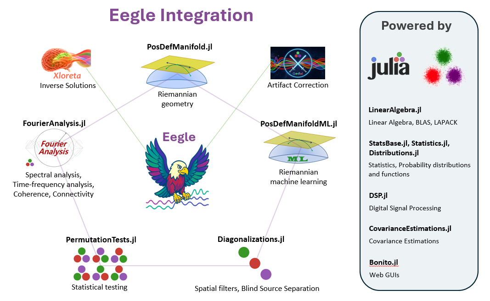

# 📘 Eegle Documentation

The **EEG General Library** (Eegle) is a general-purpose package for
preprocessing and processing human Electroencephalography (EEG) data.

It is the foundational building block that enables the integration of diverse
state-of-the-art packages specifically conceived for EEG data, 
and leveraging the powerful [Julia](https://julialang.org/) scientific eco-system.

It also provides modules for advanced EEG analysis.

**Eegle** promotes standardization, use of conventions and a learning approach based on simple examples and tutorials.



## 🧩 Requirements 

**Julia**: version ≥ 1.10

## ⚙️ Installation

Execute the following commands in Julia's REPL:

```julia
]add Eegle
```
then hit the 'back' keyboard key to exit the REPL package manager mode.


## —͟͟͞͞★ Quick Start
Read the [next page](@ref "Eegle") of this documentation for general informations, then work out the tutorials.
When you need a function, check its documentation and the examples given therein.

## ✍️ About the Authors

[Marco Congedo](https://sites.google.com/site/marcocongedo), corresponding author, is a Research Director of [CNRS](http://www.cnrs.fr/en) (Centre National de la Recherche Scientifique), working at [UGA](https://www.univ-grenoble-alpes.fr/english/) (University of Grenoble Alpes). **Contact**: first name dot last name at gmail dot com

[Fahim Doumi](https://www.linkedin.com/in/fahim-doumi-4888a9251/?locale=fr_FR) at the time of writing was a research ingeneer at the Department of Enginnering of the [University Federico II of Naples](https://www.unina.it/en_GB/home).

## 🧑‍💻 Contributors

| Contributor | Contribution |
|:----------|:----------|
| [Abdeljalil Anajjar](https://github.com/AbdeljalilAnajjar) | web GUI for downloading the [FII BCI Corpus](@ref "FII BCI Corpus Overview") and Julia artifacts for data example files |
| [Alexandre Bleuzé](https://www.linkedin.com/in/alexandre-bleuz%C3%A9-069b37154/) | Toeplitz algebra for multivariate regression mean ERP estimations |


## 🛠️ TroubleShoothing
| Problem   | Solution |
|:----------|:----------|
| No problem encountered so far | N.A.|

## 🧪 Package Test

```julia
using Pkg
Pkg.test("Eegle")
```

## 🌱 Contribute

To contribute, please check the section [How to Contribute](@ref).

## ➡️ Contents

```@contents
Pages = [       "index.md",
                "Eegle.md",
                "Tutorials.md",
                "Preprocessing.md",
                "Processing.md",
                "ERPs.md",
                "BCI.md",
                "Database.md",
                "InOut.md",
                "FileSystem.md",
                "Miscellaneous.md",
				"references.md",
		]
Depth = 1
```

## 🧭 Index

```@index
```
